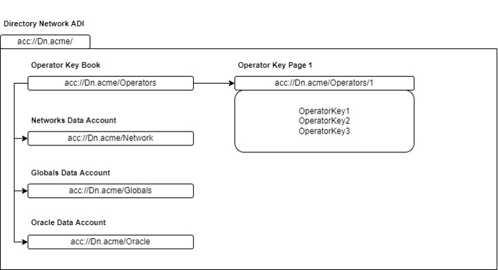

# Operator Onboarding Guide

Each operator runs a dual-mode deployment with a Directory Network Node (DNN) and Block Validator Network Node (BVNN). In Accumulate, Block Validator Networks (BVNs) contain validator nodes used to validate transactions. All transactions feed into the Directory Network (DN) containing validator nodes which anchor each BVN into the larger network.&#x20;

The network must store all operator and validator node public keys to facilitate transaction validation and other operator functions. Therefore, each operator must supply a public key representing the operator plus every node's full public key.

When launching a node through AccMan, the node will initially be a Follower. After completing the [Follower Node setup](https://docs.accumulatenetwork.io/accumulate/setup/follower-node-setup-with-accman), please follow the steps in the [Validator Node Setup guide](https://docs.accumulatenetwork.io/accumulate/setup/validator-node-setup-with-accman) to set up your Validator node.

#### Below are the following accounts an Operator will need to be aware of:

| URL                       | Description                                                                     |
| ------------------------- | ------------------------------------------------------------------------------- |
| acc://dn.acme             | ADI Account for the Directory Network                                           |
| acc://dn.acme/operators   | Operators Key Book                                                              |
| acc://dn.acme/operators/1 | Operators Key Page within the Operators Key Book                                |
| acc://dn.acme/network     | ADI Data Account that stores the Validator keys                                 |
| acc://dn.acme/globals     | ADI Data Account that defines the _Operator Accept Threshold Ratio_             |
| acc://dn.acme/oracle      | ADI Data Account that stores pricing data for the ACME-Credits conversion rate. |

<figure><figcaption></figcaption></figure>

As shown in the Diagram above, the Operator Key Book is an Authority to the Networks, Data, and Global Data Accounts and all BVN ADIs and the accounts within them. The Operator Key Book, with the URL `dn.acme/operators` has one Key Page: Operator Key Page 1 with the URL `dn.acme/operators/1`. The Operator Key Page 1 store the Operators’ keys (Public Key hashes). The keys affiliated with the public key hashes must be used to sign any transaction that adds a data entry to one of the Data Accounts. Since there is no Key Page of a higher priority than Operator Key Page 1, these keys must also sign any transaction that adds a new key to Operator Key Page 1.

The Network Data Account `dn.acme/network` contains a list of Validator keys (public key hashes) used to validate transactions. The Globals Data Account `dn.acme/globals` defines and enforces the _**Operator Accept Threshold Ratio**_, i.e., the minimum number of signatures needed by the Operator Key Page to execute a transaction. The threshold ratio is 2/3 (rounded up). This threshold ratio is used when updating the list of Validators in `dn.acme/network`


The Oracle Data Account defines the price of ACME and how many credits a user should receive for that price.&#x20;

* To add a new operator key to `dn.acme/operators/1`we execute a multi-sig UpdateKeyPage transaction signed by `dn.acme/operators`.&#x20;
* To add a new Validator key to `dn.acme/network` we execute a multi-sig WriteData transaction signed by `dn.acme/operators`. Tendermint (the consensus engine of Accumulate) uses the Validator keys to approve or reject all transactions in Accumulate.

**Command Line Interface**

An **Operator Key** can be generated in the Command Line Interface

**Syntax**

```
./accumulate key generate [Key Name]
```

**Command**

```
./accumulate key generate operatorkey1 
```

&#x20;The above command will return an output similar to the following:&#x20;

```
name : operatorkey1 lite account : acc://11d3217fda3c863c2e66936826987edb3a4467f540279689/ACME
public key : 1df37076ff875fc2a9c99a647622d33b1c194ff0d821c40b93fffac1743acca2
key type : ed25519
```

The Public Key in the Output will serve as the **Operator Public Key**

### **OPERATORS**&#x20;

./accumulate operator&#x20;

**Manage operators**&#x20;

Usage: accumulate operator \[command]&#x20;

Available Commands: add (Add an operator), remove (Remove an operator), update-key, (Update an operator's key)

Add a Key to the Operator Key Page ./accumulate operator add

\
**Syntax**

```
accumulate operator add dn [Existing Operator Key] [New Operator Key] [flags] 
```

The first argument is a Public Key of an existing Operator. The second argument is the Public Key of the new Operator. DeFi Devs will execute the transaction below to add your Operator Key to the Operator Key Page. In the example below a key was generated called “operator key.” To generate a Key in the Command Line Interface the “./accumulate key generate \[name of key]” command can be used.

**Add the Operator key**


**Command**

```
./accumulate operator add dn nodekey1 nodekey2
```

&#x20;The above command will return an output similar to the following:&#x20;

```
    Transaction Hash        : e2469b9b7ee8c554332c8fa862eacafe4ef2b4724fe27e4b5cd32779e168f077
    Signature 0 Hash        : c3a0e1a707817059c6a25d80e36866e1aec639f28e8bbd53b2a7340adc0d1a9f
    Simple Hash             : e34c51ddc4cbe4cdb1eecf397c0c6c622b78faa7a8e9b741f961dbebc7bd3ac6
    Error code              : ok
    Result                  :
```

Querying the Operator Key Page to see if the Key was added:

```
./accumulate get dn.acme/operators/1 
```

&#x20;The above command will return an output similar to the following:&#x20;

```
    Credit Balance  :       0.00

    Index  Nonce                          Key Name                                                          Delegate  Public Key Hash
    0      1969-12-31 19:00:00 -0500 EST  nodekey1            1e0ffe0dc92cef77211b4d98256aea98fd87b9ea2b3657cdbe494bbea912d839
    1      1969-12-31 19:00:00 -0500 EST  nodekey2                                                        
   f22fbe9dcb68bbbafefb99896c1e0fa54f7c0a219b2194f96955f733cfddd966
```

As shown above, the Directory Network ADI and Block Validator Network ADIs do not require credits to perform transactions. Other than this specific use case, all actions in Accumulate require credits generated by burning ACME tokens.

To conform to the 2/3 threshold, the protocol will execute: Number of Keys in Key Page \* Signature Threshold Ratio (2/3) = RoundUp(Number of Signatures Required) 2 \*(2/3) = 1.3 -> Rounded Up to Nearest Whole Number if Number is a Decimal = 2 Signatures Required From this point going forward 2 out of 2 Operator signatures are required to execute a transaction.

Next, a third Key will be added using sign a Multi-Signature Transaction based on the 2 of 2 Threshold.

Either Operator within the Key Page can execute a transaction to add a third key, but both Operators must sign the transaction for the Key to be added. In this scenario, DeFiDevs has initiated the transaction.

```
./accumulate operator add dn nodekey nodekey3 
```

The above command will return an output similar to the following:&#x20;

```
    Transaction Hash        : 28f0df5f19f4d60639b415b9f9ce287e15c26c0cdbebd6655caf9602d65dc274
    Signature 0 Hash        : bf3df0d3f6160613b689be4e024163264bf60d2aa9ae0daecb3f68948aa6aea6
    Simple Hash             : 44bd7361c22a616b893cf416784786d32fdac5cd550a5c6a67db690b29d6f118
    Error code              : ok
    Result                  :
```

The second Operator needs to sign the Transaction Hash to fulfill the Multi-Signature transaction.

```
./accumulate tx sign Usage: accumulate tx sign [origin url] [n Signer Key Name]] [txid] Sign a pending transaction
```

The origin url is the Operator Key Page, which is being updated. The Signer Key refers to a party that needs to sign the multi-signature transaction. The transaction hash refers to the hash produced from the initial transaction.

```
./accumulate tx sign dn.acme/operators/1 nodekey2 28f0df5f19f4d60639b415b9f9ce287e15c26c0cdbebd6655caf9602d65dc274
```

The above command will return an output similar to the following:&#x20;

```
    Transaction Hash        : 28f0df5f19f4d60639b415b9f9ce287e15c26c0cdbebd6655caf9602d65dc274
    Signature 0 Hash        : e20d78e40c8a7070820329f850b164b9d89f539f9fd585dfc59a0ef8b0075396
    Simple Hash             : e32900e73df423b1f8d6247a1e13618f743cf071ec958220856fa941c6bc8836
    Error code              : ok
    Result                  :
```

Querying the Operator Key Page to see if the Key was added:

```
./accumulate get dn.acme/operators/1 
```

The above command will return an output similar to the following:&#x20;

```
    Credit Balance  :       0.00

    Index  Nonce                          Key Name                                                          Delegate  Public Key Hash
    0      1969-12-31 19:00:00 -0500 EST  nodekey1      1e0ffe0dc92cef77211b4d98256aea98fd87b9ea2b3657cdbe494bbea912d839
    1      1969-12-31 19:00:00 -0500 EST  nodekey2                                                  
   f22fbe9dcb68bbbafefb99896c1e0fa54f7c0a219b2194f96955f733cfddd966
    2      1969-12-31 19:00:00 -0500 EST  nodekey3                                                    
 0cd684e23ca541d13b03f977a9f3556f867e2a67ab868e710c66739520cdbcb4
```

To conform to the 2/3 threshold, the protocol will execute: Number of Keys in Key Page \* Signature Threshold Ratio (2/3) = RoundUp(Number of Signatures Required) 3 \*(2/3) = 2 -> Rounded Up to Nearest Whole Number if Number is a Decimal = 2 Signatures Required From this point going forward 2 out of 2 Operator signatures are required to execute a transaction.

Remove a Key from an Operator Key Page: To remove a Key from the Key Page 2 of the 3 Keys need to sign a transaction for it to be processed.

```
./accumulate operator remove dn nodekey1 nodekey3
```

The above command will return an output similar to the following:&#x20;

```
    Transaction Hash        : 30691a0ecdaad77455d65598194d4cf2be86143ca7029b57bf5665a14398e143
    Signature 0 Hash        : 050c9cdaf8501f86f15bfdc919e499157a8e6010da7399443bb1bcee9b03273b
    Simple Hash             : f194f98d033aaa0b69dd13b261a17a04574c4e05345199cc715a45d14b30a2bc
    Error code              : ok
    Result                  :
```

One of the two remaining operators needs to the transaction hash:

```
./accumulate tx sign dn.acme/operators/1 nodekey2 30691a0ecdaad77455d65598194d4cf2be86143ca7029b57bf5665a14398e143 
```

The above command will return an output similar to the following:&#x20;

```
    Transaction Hash        : 30691a0ecdaad77455d65598194d4cf2be86143ca7029b57bf5665a14398e143
    Signature 0 Hash        : b4cc9b55b11d35ae84e11fdc2563a3e5e1959b9505a6e75ad87a1ce68d2d378b
    Simple Hash             : b57701b421a14acc1a629a1e7bf26f421406e69a115c00a67d7062244fba77e9
    Error code              : ok
    Result                  :
```

Querying the Operator Key Page to see if the Key was Removed:

```
./accumulate get dn.acme/operators/1 
```

The above command will return an output similar to the following:&#x20;

```
    Credit Balance  :       0.00

    Index  Nonce                          Key Name                                                          Delegate  Public Key Hash
    0      1969-12-31 19:00:00 -0500 EST  nodekey1          1e0ffe0dc92cef77211b4d98256aea98fd87b9ea2b3657cdbe494bbea912d839
    1      1969-12-31 19:00:00 -0500 EST  nodekey2                                                      
   f22fbe9dcb68bbbafefb99896c1e0fa54f7c0a219b2194f96955f733cfddd966
```

&#x20;**Update the Key**

Update your own Key in the Operator Key Page:

When you are updating your own Key within a Key Page you do not have to conform to the signature threshold.\


The command that an Operator would use is:

accumulate page key replace \[key page url] \[key name\[@key book or page]] \[new public key or name] \[flags]\


The signature threshold is 1 of 1 for this transaction only, all other transactions will require the Key Page threshold. In the example below, DeFi Devs wants to update _someone else's_ key which would required the 2 of 3 threshold.

**Syntax**

./accumulate operator update-key

**Command**\
Usage: accumulate operator update-key dn \[Signing Key] \[old key name or path] \[new key name or path] \[flags]

./accumulate operator update-key dn nodekey1 nodekey2 updatedkey

```
    Transaction Hash        : 0a9d215fa33f98a1ffa9d64f2493e47f9aa3b4b5ca615fddd594fe82d1e77431
    Signature 0 Hash        : 9f5dea9f0dd7ad40fd7ac2921bf4d99efb52559a8af42e0a675b186bd83bfe48
    Simple Hash             : dc3679af7a7732506edc1ce2a7a6cc5067328e74c4d0d474ae8376265e84194a
    Error code              : ok
    Result                  :
```

Sign Transaction Hash: ./accumulate tx sign dn.acme/operators/1 nodekey2 6827da678ce369d34398848cc652e6ac1b4e2acf23aac0b74b5e8e0a57c6f642

```
    Transaction Hash        : 0a9d215fa33f98a1ffa9d64f2493e47f9aa3b4b5ca615fddd594fe82d1e77431
    Signature 0 Hash        : f16e6aac309da18a0f1e4cc2ed2275b046640a1ffc5bcd374206274cd2abb655
    Simple Hash             : f1e99d4670c870591f354264b4788c238a57ac1b9ba0bd468e08c69d27fb6877
    Error code              : ok
    Result                  :
```

Query Operator Key Page: ./accumulate get dn.acme/operators/1 Password: \*\*\*\*\*\*\*\*

```
    Credit Balance  :       0.00

    Index  Nonce                          Key Name                                                          Delegate  Public Key Hash
```

0 1969-12-31 19:00:00 -0500 EST nodekey1 1e0ffe0dc92cef77211b4d98256aea98fd87b9ea2b3657cdbe494bbea912d839 1 1969-12-31 19:00:00 -0500 EST updatedkey\
31f15c6bf79bf76cecbf59513c2bbaaca24281151a1038cf083e178b2e026cab

### **VALIDATORS**

./accumulate validator Manage validators Usage: accumulate validator \[command] Available Commands: add Add a validator remove Remove a validator update-key Update a validator's key

Adding a Validator Key is a separate Operation from adding an Operator Key. The Operator Key Book is an Authority to the Network Data Account that Lists the Validator Keys. This means that the Operators need to sign a transaction to add a Validator to the Validator Set. The DN operator Key Page has two Keys which means a Multi-Signature Transaction is required. ./accumulate get dn.acme/operators/1 Password: \*\*\*\*\*\*\*\*

```
    Credit Balance  :       0.00

    Index  Nonce                          Key Name                                                          Delegate  Public Key Hash
```

1 1969-12-31 19:00:00 -0500 EST nodekey1 1e0ffe0dc92cef77211b4d98256aea98fd87b9ea2b3657cdbe494bbea912d839 1 1969-12-31 19:00:00 -0500 EST updatedkey\
31f15c6bf79bf76cecbf59513c2bbaaca24281151a1038cf083e178b2e026cab

Sign a Transaction with Operator Key to add a Validator Key to the Network Data Account ./accumulate validator add dn nodekey1 nodekey3 Password: \*\*\*\*\*\*\*\*

```
    Transaction Hash        : aaee722519006cbf8ae0d5f20c4415769a07c0ca6571f8a410166d9664ccff13
    Signature 0 Hash        : 3c149e78d963455f22ec0a9cd5c4083fe2138f36f17cda6daa218a528d8a3a1b
    Simple Hash             : c92918b687a6e3943ce27b68245736dcc0c03bfd2aaf80dead8f21a195417587
    Error code              : ok
    Result                  : Account URL   acc://dn.acme/network
                              Account ID    9084f525bdaf602638ac488a926b5258da904cc4f3afbf824ec8936424d5f421   
                              Entry Hash    3bb9b4a7b3df97d2c4b0e54b639c9a42baaacac062846ccec20c5c24884eb1a6
```

Sign the Transaction Hash: ./accumulate tx sign dn.acme/network updatedkey aaee722519006cbf8ae0d5f20c4415769a07c0ca6571f8a410166d9664ccff13 Transaction Hash : 33ee722519006cbf8ae0d5f20c4415769a07c0ca6571f8a410166d9664ccff51 Signature 0 Hash : 59149e78d963455f22ec0a9cd5c4083fe2138f36f17cda6daa218a528d8a3a21 Simple Hash : 622918b687a6e3943ce27b68245736dcc0c03bfd2aaf80dead8f21a195417566 Error code : ok Result : Account URL acc://dn.acme/network

A Get Command on the Network Data Account shows the Validator Keys: ./accumulate get dn.acme/network

(type): Url: acc://dn.acme/network Value: (type): Network Definition NetworkName: DevNet Version: 1 Partitions: 0 (elem): (type): Partition Info ID: BVN1 Type: blockValidator 1 (elem): (type): Partition Info ID: Directory Type: directory Validators: 0 (elem): (type): Validator Info PublicKey: 32ccc129c90e2c5dc9889e500719fdd129ac80b8eb669a9ed59d579c9ae17db7 PublicKeyHash: 1e0ffe0dc92cef77211b4d98256aea98fd87b9ea2b3657cdbe494bbea912d839 Partitions: 0 (elem): (type): Validator Partition Info ID: Directory Active: true 1 (elem): (type): Validator Info PublicKey: 0cd684e23ca541d13b03f977a9f3556f867e2a67ab868e710c66739520cdbcb4 PublicKeyHash: 92c358f53581aa5066b7485b10d668d7c491c34608f6549bea43c4f3ee4a7d9f Partitions: 0 (elem): (type): Validator Partition Info ID: Directory Active: true 1 (elem): (type): Validator Partition Info ID: BVN1 Active: true

Remove a Validator Key ./accumulate validator remove nodekey1 nodekey3

```
   Transaction Hash  : 35db1f2bed8d8d85b85d0197b2b71666b1741ba2ef0c953a6055a7643a1ab6af
   Signature 0 Hash        :158d5724e48346197e102108e32cd1663ce972cde3fd60d64d8ba579fb34a997
    Simple Hash             : f45d0547fdab733868f053b789ad227c39ccd36c59b4c199d12d8a64e3024e46
    Error code              : ok
    Result                  : Account URL   acc://dn.acme/network
                              Account ID    5514f525bdaf602638ac488a926b5258da904cc4f3afbf824ec8936424d5ff83   
                              Entry Hash    145b4a7b3df97d2c4b0e54b639c9a42baaacac062846ccec20c5c24884eb1a6
```

Sign the Transaction Hash: ./accumulate tx sign dn.acme/network updatedkey 35db1f2bed8d8d85b85d0197b2b71666b1741ba2ef0c953a6055a7643a1ab6af Transaction Hash : 33ee722519006cbf8ae0d5f20c4415769a07c0ca6571f8a410166d9664ccff51 Signature 0 Hash : 59149e78d963455f22ec0a9cd5c4083fe2138f36f17cda6daa218a528d8a3a21 Simple Hash : 622918b687a6e3943ce27b68245736dcc0c03bfd2aaf80dead8f21a195417566 Error code : ok Result : Account URL acc://dn.acme/network

A Get Command on the Network Data Account shows the Validator Keys: ./accumulate get dn.acme/network

(type): Url: acc://dn.acme/network Value: (type): Network Definition NetworkName: DevNet Version: 1 Partitions: 0 (elem): (type): Partition Info ID: BVN1 Type: blockValidator 1 (elem): (type): Partition Info ID: Directory Type: directory Validators: 0 (elem): (type): Validator Info PublicKey: 32ccc129c90e2c5dc9889e500719fdd129ac80b8eb669a9ed59d579c9ae17db7 PublicKeyHash: 1e0ffe0dc92cef77211b4d98256aea98fd87b9ea2b3657cdbe494bbea912d839 Partitions: 0 (elem): (type): Validator Partition Info ID: Directory Active: true

Update a Validator Key There is a special procedure for updating a Validator Key.

1. Launch a New Node
2. Use the Key from new Node in the Update-Key function

./accumulate validator update-key Usage: accumulate validator update-key dn] \[Signing Key] \[old key name or path] \[new key name or path] \[flags]

./accumulate validator update-key dn nodekey1 node1 updatedkey\
Password: \*\*\*\*\*\*\*\*

```
 Transaction Hash        : 18d0321582896b74c282db30b8c4c5839a7652c9ddf820cb41a51874ba076705
    Signature 0 Hash        : 7b31a4bc7d6c0b5d86ef7e966b03f6106fc98a43542cd7baf80cdf78c60ae462
    Simple Hash             : 6b50d6eabef9658b865a7334b3e5e8acbdc21b0382dcbe0a0e7c437ca8f964ec
    Error code              : ok
    Result                  :
```

Sign Transaction Hash: ./accumulate tx sign dn.acme/operators/1 nodekey1 18d0321582896b74c282db30b8c4c5839a7652c9ddf820cb41a51874ba076705

Password: \*\*\*\*\*\*\*\*

```
 Transaction Hash        : 18d0321582896b74c282db30b8c4c5839a7652c9ddf820cb41a51874ba076705
 Signature 0 Hash        : 194c1a86cbdc75e764cefb8438be4a6fbee06d2fcff56ced3ebbcc5a96542a91
 Simple Hash             : bd9f02e83731ddb17f725394f0328d6ce4956132bd328b1b77b25c5d06fb2411
 Error code              : ok
 Result                  :
```

A Get Command on the Network Data Account shows the Validator Keys: ./accumulate get dn.acme/network

(type): Url: acc://dn.acme/network Value: (type): Network Definition NetworkName: DevNet Version: 1 Partitions: 0 (elem): (type): Partition Info ID: BVN1 Type: blockValidator 1 (elem): (type): Partition Info ID: Directory Type: directory Validators: 0 (elem): (type): Validator Info PublicKey: 31f15c6bf79bf76cecbf59513c2bbaaca24281151a1038cf083e178b2e026cab PublicKeyHash: ee8e2e5da29781aa619590a3ef98c33f2f688f7f5b96d0931cdc15ed09cc99a6 Partitions: 0 (elem): (type): Validator Partition Info ID: Directory Active: true

Changing the Oracle Value Transaction in Accumulate Require Credits. Certain actions require a different amount of Credits See Fee Schedule: https://docs.accumulatenetwork.io/accumulate/getting-started/fees

1 Credit always equals $0.01 If the value of ACME increases or decreases the Oracle needs to change to maintain the ration of 1 credit equaling $0.01.

Querying the Oracle: ./accumulate oracle USD per ACME : $0.0500 Credits per ACME : 5.00

As shown, if the price of ACME is $0.0500 then the Credits per ACME is 5.00 to retain 1 credit equaling $0.01 (5/$0.0500). If the price of ACME increases to $0.0600 the credits per ACME would be 6.00.

Signing a Transaction to change the Oracle Value:

./accumulate data write dn.acme/oracle updatedkey 01d804 --sign-with nodekey1 --write-state\
Password: \*\*\*\*\*\*\*\*

```
    Entry Hash              :471002594e7834d19879036cd174bead906cbaafc3164e30b4ed411c91b8dfbd
    Transaction Hash        : 915e1992b783342f15dedb8a9e3c6457f007b0cfd4a1278010f8af9126736b39
    Signature 0 Hash        : 372cd19c39e5e0ac8deb5727520d1e8ea5936c4a65ace2683b443364142bbcbd
    Signature 1 Hash        : 8e0b03a5409ce5495e3c2e793481dbdb6ea3591b049b23282854076649337b00
    Simple Hash             : 8f8a2c9eb8f55d4bdc71c55b8c53bdc102ce3bccdae0b8b3b9f0a41efb14b4d3
    Error code              : ok
    Result                  : Account URL   acc://dn.acme/oracle
                              Account ID    0fbddd4a41b9996ea1907911a5b3e0b1354e7c95107613b9207d516efb245553   
                              Entry Hash    471002594e7834d19879036cd174bead906cbaafc3164e30b4ed411c91b8dfbd   
```

PS C:\Users\Mr. Ben\accumulate> ./accumulate get dn.acme/oracle\
(type): Url: acc://dn.acme/oracle Value: (type): Acme Oracle Price: 600
