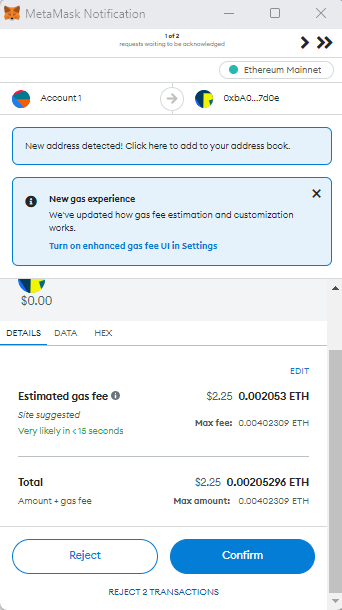

# Validator Node Setup with AccMan

Please complete the Follower Node Setup guide. To become a Validator Node, a Follower Node is created first. It is recommended to use Accman for this process.

.png>)

Select "Accumulate - Manage Node" and hit Enter

Scroll Down to “Display Registration Info” and Click Enter

.png>)

The Public Key (pubkey) is what an Operator will provide as their **Validator Key** to the Protocol

The address is a Hash of the Public Key

It is recommended that the Operator's **Operator Key** is different than the Validator Key\

An **Operator Key** can be generated in the Command Line Interface

./accumulate key generate \[Key Name]

./accumulate key generate operatorkey1&#x20;

Password: \*\*\*\*\*\*\*\*&#x20;

name : operatorkey1 lite account : acc://11d3217fda3c863c2e66936826987edb3a4467f540279689/ACME\
public key : **1df37076ff875fc2a9c99a647622d33b1c194ff0d821c40b93fffac1743acca2**\
key type : ed25519

The Public Key in the Output will server as the **Operator Public Key**

_Please Provide the **Validator Public Key** and **Operator Public Key** to a member of the Operator Key Page. Two-thirds of the Operators will sign a transaction to add your **Operator Key** and a second transaction to add your **Validator Key.**_

When you search in a Web Page your node's I.P. (I.P. :16592.status), if the voting power is 0 you are running a follower node. If the voting power is 1 you are running a Validator Node.&#x20;

_****_.png>)_****_

In a future AccMan release the type of Node you are running will be visible in your AccMan console.

_To Verify your Operator Key is in the Operator Key Page query_ \
_./accumulate get dn.acme/operators/1 in the CLI._&#x20;

_To Verify your Validato Key is in the Networks Data Account query_

_./accumulate get dn.acme/network_

\
