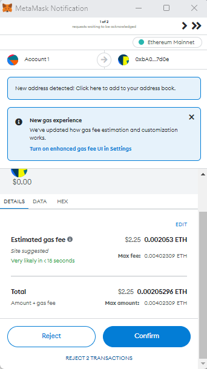

# How to use the Accumulate/Ethereum Bridge


## **Mainnet Bridge:** [**https://bridge.accumulatenetwork.io/mint**](https://bridge.accumulatenetwork.io/mint)****

**Goerlie Testnet Bridge:**  [**https://testnet.bridge.accumulatenetwork.io/mint**](https://testnet.bridge.accumulatenetwork.io/mint)****

## **Will my MetaMask wallet support Accumulate?**

Unfortunately, because Accumulate and Metamask are incompatible, you cannot directly add ACME, Accumulate's native token, to your Metamask wallet.&#x20;

But there may be other approaches to adding Accumulate to Metamask.&#x20;

Only blockchains created using the Ethereum Virtual Machine's primary programming language, Solidity, are supported by Metamask.&#x20;

You can download the browser extension or app to access it via this [link](https://metamask.io/)

### **What is a bridge?**

Bridges exist to connect blockchain networks. They enable connectivity and interoperability between blockchains.

They create a route for transporting tokens, messages, arbitrary data, and even smart contract calls from one blockchain to another.

**Prerequisites**

* Metamask account
* Basic knowledge of [Accumulate CLI commands](https://docs.accumulatenetwork.io/accumulate/cli/cli-reference)
* Accumulate [CLI Setup](https://docs.accumulatenetwork.io/accumulate/cli/cli-setup)

### Configuring Metamask for Mainnet

1. Open the Metamask browser extension on your pc.
2. Confirm Ethereum Mainnet dropdown&#x20;

<figure><figcaption><p>dropdown menu</p></figcaption></figure>

To use the Accumulate Mainnet Bridge please go to: [https://bridge.accumulatenetwork.io/mint](https://bridge.accumulatenetwork.io/mint)

### Configuring Metamask for Goerli Testnet

If you want to use the testnet, click on the Ethereum Mainnet dropdown scroll **Advanced** and toggle the **Show test networks** to **ON**

<figure><figcaption><p>Show test network</p></figcaption></figure>

1\. Click on the Goerli test network

To use the Accumulate Testnet Bridge please go to: [https://testnet.bridge.accumulatenetwork.io/mint](https://testnet.bridge.accumulatenetwork.io/mint)


## Sending ACME through the Bridge Example (ACME->WACME):

Below is an example of using the bridge on the Ethereum Mainnet sending ACME and minting Wrapped ACME in Ethereum.


**The same instructions apply for the Goerli Testnet except:**\
**1. There is a faucet to get ACME on the Accumulate TestNet**\
**2. The bridge address you are sending ACME tokens to  acc://bridge.acme/5-ACME**\
**3. The contract address for importing WACME to MetaMask for the Goerli Testnet: `0xCD08505D03B6bc1a84A5E706536562546A9c99f9`**


1. Click on **connect a wallet,** then you will see a pop-up similar to the image below.

<figure><figcaption></figcaption></figure>

Click on the **Metamask** button**.** Then a transaction will be sent to your Metamask wallet for your approval.

After approving the transaction, your bridge will be connected to your Metamask wallet.

<figure><figcaption></figcaption></figure>

2\. **** Type in the amount of ACME you want to send. &#x20;

In this example, I entered 90 **ACME.**

****.png>)****

****

3\. Click **Next** to view the mint instruction.

.png>)

The next step is to transfer ACME tokens to your Metamask wallet.

### **Send tokens to bridge token account**

**Generate Lite Token Account**&#x20;

```
./accumulate key generate test1 (key name)
```

```

Password: ********************
 Name         | test1
 Lite Account | acc://cd6dfd30c1c66851cfea57631b0d1c0c7a6ea220df710bd4/ACME
 Public Key   | 74fdd07e5108a284bfc8ec995b85665399de4d1328d22566f684a18d889b4f2a
 Key Hash     | cd6dfd30c1c66851cfea57631b0d1c0c7a6ea2204f1a76d7b6de31644e7e056b
 Key Type     | ed25519
 Derivation   | m/44'/281'/0'/0'/1'
```

**Add Tokens to Lite Token Account (Send Tokens to Account's Address)**

**Add Credits to Lite Token Account**&#x20;

Add credit to your lite token account by running the command below.

```
./accumulate credits acc://cd6dfd30c1c66851cfea57631b0d1c0c7a6ea220df710bd4/ACME acc://cd6dfd30c1c66851cfea57631b0d1c0c7a6ea220df710bd4/ACME 100
```

The above command will return an output similar to the following:&#x20;

```


        Transaction Hash        : 10f3aafbf8e4671505e0bcaaca7260f285e756f6a43b5011f5413e72e46ab9c4
        Signature 0 Hash        : c360b1dd838293f949464676260685bce5c61e9a5fe5986f184f78fa6ca4d8a6
        Simple Hash             : ce11fd8b00900542e8a9a766eee32ecf13bda77029c49133b69bf413a2f16f23
        Error code              : ok
        Result                  : Oracle        $0.50 / ACME
                                  Credits       100.00
                                  Amount        2.00000000 ACME
```

**Send Tokens to the Bridge Token Account which is Displayed in the Mint Instructions and Add a Memo Field Containing your Ethereum Address shown in your Meta Mask wallet**&#x20;

```
./accumulate tx create acc://9a4df91123d42b5926b6e84dac256ddc8a1e32f8c5a59554/ACME acc://bridge.acme/1-ACME 90 --memo ‘0x2F0A0C3341C63D647FE7f5f3bbFCcb4f6DbE7938'
```

The above command will return an output similar to the following:&#x20;

```
 Transaction Hash        : c3ac9f185745f38a95725e04e45c7a14a44cbe9cfafd5e2715a3d1b99eecbced
        Signature 0 Hash        : 9e63990ce7bd074c54c271983ee864512127c440042d99525625fa6f30344dfe
        Simple Hash             : 7dccf4538317961988b0d2a10c1f4eb2e29d1211a0f49e743a22a8e2ceceaab1
        Error code              : ok
        Result                  :
```

1. Open your MetaMask



2\. In the tab, Click on **Assets** then click [**Import tokens**](https://metamask.zendesk.com/hc/en-us/articles/360015489031-How-to-display-tokens-in-MetaMask) **** and paste this contract address 0xDF4Ef6EE483953fE3B84ABd08C6A060445c01170 in the **Token contract address** field&#x20;

.png>)

3\. Click add custom token

.png>)

4\. Finally, click Import tokens

.png>)


Current ACME Balance

```
./accumulate get acc://cd6dfd30c1c66851cfea57631b0d1c0c7a6ea220df710bd4/ACME                                                                    
        Account Url     :       acc://cd6dfd30c1c66851cfea57631b0d1c0c7a6ea220df710bd4/ACME
        Token Url       :       acc://ACME
        Balance         :       8.00000000 ACME
        CreditBalance   :       94.00
        Last Used On    :       1970-01-20 02:37:32.631597 -0500 EST
        Lock Height     :       0
```

## Sending WACME through the Bridge Example                    (WACME->ACME):

Connect the MetaMask Wallet on the Mainnet

1. Enter in the Amount of ACME you would like released and the destination and click approve.

.png>)


Make sure you have Eth in your Wallet to Sign Transactions on the Mainnet.\
Use Goerli Eth on the Testnet to Pay for Transactions:&#x20;

[https://goerlifaucet.com/](https://goerlifaucet.com/)


If you will be signing transactions with a Ledger Device connected to MetaMask you will need to enable [blind signing.](https://www.ledger.com/academy/enable-blind-signing-why-when-and-how-to-stay-safe)

Click Confirm

 (2).png>)

Click Release&#x20;

 (2).png>)

Click Confirm

.png>)

Current Balance

```
./accumulate get acc://cd6dfd30c1c66851cfea57631b0d1c0c7a6ea220df710bd4/ACME                                                                    
        Account Url     :       acc://cd6dfd30c1c66851cfea57631b0d1c0c7a6ea220df710bd4/ACME
        Token Url       :       acc://ACME
        Balance         :       47.35225000 ACME
        CreditBalance   :       94.00
        Last Used On    :       1970-01-20 02:37:32.631597 -0500 EST
        Lock Height     :       0
```

\
